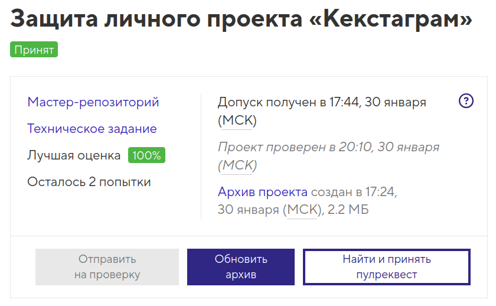

# Учебный проект «Кекстаграм»

Репозиторий создан для обучения на профессиональном онлайн‑курсе   «[JavaScript. Профессиональная разработка веб-интерфейсов](https://htmlacademy.ru/intensive/javascript)» от [HTML Academy](https://htmlacademy.ru).

<h4>Курс пройден в 2025 году</h4>

  

- Студент: [Виктория Калугина](https://up.htmlacademy.ru/javascript-individual/2/user/1788421).
- Наставник: `Виктория Никитина`.
- Проект: [«Кекстаграм»](https://toryatoria.github.io/1788421-kekstagram-2/)

---

## Описание

**«Кекстаграм»** - сервис просмотра изображений. Пользователям предоставлена возможность просматривать фотографии, загруженные ранее другими и загружать свои фотографии.

Проект создан для отработки навыков работы с JavaScript, взаимодействия с DOM, реализации AJAX-запросов и работы с формами.

Основная цель проекта — разработка сервиса для просмотра и загрузки изображений с возможностью редактирования, добавления эффектов, комментариев и хэштегов.

Вёрстка и стилизация даны изначально, в проекте реализуется только логика работы на JS.

### Стек технологий

- **JavaScript (ES6+):** Основной язык разработки
- **noUiSlider:** Реализация слайдера для выбора интенсивности эффектов.
- **Pristine.js:** Валидация формы.
- **Fetch API:** Отправка и получение данных с сервера.

## Реализованные функции

### Просмотр изображений других пользователей

- Загрузка массива фотографий и комментариев с удалённого сервера.
- Отрисовка миниатюр.
- Полноэкранный режим с порционной подгрузкой комментариев.
- Фильтрация изображений.

<!-- **Комментарии**

- Добавление комментариев: При открытом полноэкранном режиме пользователь может ввести текст в форму и отправить комментарий.
- Валидация с помощью Pristine.js: поле не может быть пустым и не должно превышать 140 символов.
- Удаление комментариев: каждый добавленный комментарий имеет кнопку «Удалить», позволяющую убрать его из списка.

**Лайки**

- Одиночный лайк: При клике на счётчик лайков фотография получает +1 лайк.
- Предотвращение повторного лайка: повторный клик не увеличивает счётчик лайков повторно. -->

### Загрузка нового изображения на сайт

Выбор файла с изображением для загрузки;

#### Редактирование

- изменение масштаба изображения;
- применение одного из эффектов: «Хром», «Сепия», «Марвин», «Фобос», «Зной»;
- выбор глубины эффекта с помощью ползунка;
- добавление текстового комментария;
- добавление хэш-тегов.

#### Валидация

- Валидация полей хэш-тегов и комментариев.
- Проверка срабатывает при отправке формы на сервер и не даёт отправть её если есть ошибки.

#### Отправка формы

- Отправка данных на сервер.
- При успехе/ошибке — отображение соответствующего экрана.

---

## Благодарности

- Команде [HTML Academy](https://htmlacademy.ru) за материалы и консультации.
- Наставнику за поддержку и советы.

---

#### Буду рада любым отзывам и Pull Request!
